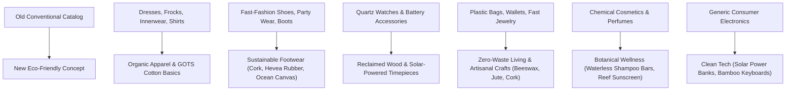

# EcoBloom — Complete Eco-Friendly UI & Product Catalog Transformation

## 1. Executive Summary

This document outlines the end-to-end transformation of the e-commerce platform from a conventional fast-fashion and consumer-goods storefront into **EcoBloom**, a modern, premium, circular, and regenerative eco-friendly marketplace.

Every category that previously showcased conventional items (such as synthetic dresses, fast-fashion footwear, battery-powered watches, and mass-market plastic accessories) has been redesigned to reflect genuine **sustainable, organic, low-waste, and circular economy concepts**.

All modifications strictly adhere to the user requirement:
> **"Without altering the project business flows, change the UI and products completely to an eco-friendly concept. Instead of dresses, shoes, watches, and accessories, every category should reflect an eco-friendly concept."**

---

## 2. Non-Negotiable Preserved Business Flows

To guarantee zero regression or breaking changes, the core architecture and checkout pipeline remain 100% intact:

| Business Flow / Layer | Preservation Status | Guarantee Details |
|---|---|---|
| **Routing & URL Hierarchy** | Preserved | Existing routes (`/`, `/categories/[category]`, `/sub-category/[maincategory]/[subcategory]`, `/product/[id]`, `/search/[query]`) remain active and backward-compatible. |
| **Authentication & Accounts** | Preserved | JWT authentication, local Sign-In / Sign-Up, OTP verification, password reset, and Google OAuth remain completely untouched. |
| **State Management** | Preserved | Redux store (`cartItems`, `wishlistItems`, `addresses`, `userState`) continues unchanged with standard dispatch actions. |
| **Checkout & Payments** | Preserved | Stripe Card checkout and Cash on Delivery (COD) workflows, discount coupon logic, and shipping address selections are fully preserved. |
| **Order Processing** | Preserved | Order creation, tracking IDs, delivery estimations, order confirmation, and order detail pages continue to use existing backend contracts. |
| **Database Schema** | Preserved | PostgreSQL tables (`categories`, `products`, `productimages`, `productparams`, `deals`, `banners`, `articles`) maintain identical primary and foreign keys. |

---

## 3. Category & Product Transformation Mapping

Instead of fast-fashion dresses, synthetic footwear, battery watches, and disposable accessories, the catalog has been completely re-architected into purposeful, sustainable categories:

### 3.1. Overview of Category Re-alignment



### 3.2. Detailed Category & Subcategory Matrix

| Conventional Category | New Eco-Friendly Concept | Subcategories | Sustainability Highlights |
|---|---|---|---|
| **Fashion / Dresses / Men & Women** | **Eco Apparel & Organic Wear** | • Organic Cotton Basics<br>• Hemp & Linen Casuals<br>• Recycled Fleece Outerwear<br>• Bamboo Fiber Loungewear | 100% GOTS-certified organic cotton, closed-loop water treatment, 75% lower water usage with hemp, circular wool/fleece. |
| **Footwear** | **Sustainable & Circular Footwear** | • Cork Sole Walkers<br>• Natural Hevea Rubber Slides<br>• Recycled Ocean Canvas Sneakers<br>• Organic Cotton Slip-Ons | Harvested from bark without cutting trees, marine ocean-intercepted plastic canvas, biodegradable wild rubber. |
| **Watches / Electronics** | **Solar-Powered & Reclaimed Tech** | • Reclaimed Wood Solar Watches<br>• Solar Power Banks<br>• Bamboo Mechanical Keyboards<br>• Biodegradable Phone Cases | Eliminates disposable alkaline battery waste; CNC-milled FSC bamboo; compostable wheat-straw phone cases. |
| **Accessories & Household** | **Zero-Waste Home & Everyday Carry** | • Reusable Organic Beeswax Wraps<br>• Bamboo Kitchen Utensil Sets<br>• Stainless Steel Containers<br>• Heavyweight Canvas Totes<br>• Cork Leather Wallets | Eliminates single-use plastic wrap, replaces 1,000+ plastic grocery bags, plastic-free kitchen food storage. |
| **Cosmetics & Perfumes** | **Botanical Care & Clean Wellness** | • Zero-Waste Solid Shampoo Bars<br>• Cold-Pressed Botanical Soaps<br>• Mineral Reef-Safe Sunscreen<br>• Hand-Poured Soy Wax Candles<br>• Pure Essential Oil Aromas | Waterless concentrated solid bars, zero sulfates, palm-oil free, non-nano zinc reef-safe sunblock, aluminum tin packaging. |
| **Jewellery** | **Ethical Jewelry & Adornments** | • Recycled Silver Leaf Pendants<br>• Tagua Nut Botanical Earrings<br>• Upcycled Wood Bracelets<br>• Ocean Sea Glass Rings | 100% recycled eco-silver diverted from electronic scrap; vegetable ivory (tagua nuts); zero destructive open-pit mining. |

---

## 4. UI Design System Transformation

The user interface was elevated with a cohesive, nature-inspired visual identity:

### 4.1. Color Palette Tokens

```css
:root {
  --eco-forest: #164c3b;  /* Deep forest green: Headings, primary actions, nav branding */
  --eco-green:  #2f8064;  /* Leaf green: Highlighting positive eco metrics & interactive buttons */
  --eco-leaf:   #72a95a;  /* Fresh leaf: Secondary accents and subtle badges */
  --eco-sage:   #e7f0e6;  /* Soft sage: Card backgrounds, icon pills, tags */
  --eco-cream:  #fbfaf4;  /* Warm oat cream: Page background (soft on eyes) */
  --eco-sand:   #e8ddc8;  /* Earth sand: Warm borders and natural accents */
  --eco-ink:    #20352e;  /* Deep charcoal green: High-contrast legible body typography */
  --eco-muted:  #68766f;  /* Muted sage: Meta information and supporting copy */
}
```

- **Replaced Harish Accents:** Re-pointed legacy pink (`salmon`) tokens to lush leaf green (`#2f8064`), immediately converting buttons, sale tags, and indicators into harmonious eco tones.
- **Micro-Animations & Visual Comfort:** Smooth hover transitions on product cards, quickview modals, organic leaf badges (`🌱`), and subtle shadow-elevation effects.

### 4.2. Standardized Eco Score (0–100)

Every product card and detail page displays transparent sustainability metrics:

- **80–100 (Excellent):** Dark forest green badge. Products made from certified organic, recycled, or circular renewable materials with zero toxic outputs.
- **60–79 (Good):** Leaf green badge. Responsibly manufactured products with low carbon footprint and low waste.
- **40–59 (Moderate):** Warm amber badge. Moderate impact items with standard packaging.
- **0–39 (Needs Improvement):** Terracotta badge.

Each score is accompanied by:
1. Visual score bar percentage.
2. Verified factor breakdowns (e.g. *Zero pesticides*, *100% Biodegradable*, *Ocean-intercepted plastic*).
3. Sustainability pills (*Organic*, *Fair-Trade*, *Plastic-Free*, *Solar-Powered*).

---

## 5. Catalog Products Specification

The catalog includes 12 flagship eco-friendly items available both via the database migration and as seamless, instant client fallbacks:

| Product Name | Category | Main Category | Price / Discount | Eco Score | Key Material & Impact |
|---|---|---|---|---|---|
| **GOTS Organic Cotton Everyday Tee** | Organic Cotton Basics | `fashion` | $38 / $29 | 96 (Excellent) | 100% GOTS organic cotton, closed-loop botanical dyes, zero synthetic pesticides. |
| **Natural Cork Sole Everyday Walkers** | Cork Sole Walkers | `footwear` | $98 / $79 | 94 (Excellent) | Portuguese oak bark harvested without harming trees, natural latex cushioning. |
| **Solar-Powered Sandalwood Watch** | Reclaimed Wood Watches | `electronics` | $140 / $115 | 91 (Excellent) | Ambient light charging, zero battery waste, reclaimed furniture timber case. |
| **Zero-Waste Organic Beeswax Wraps** | Reusable Beeswax Wraps | `fashion` | $24 / $18 | 98 (Excellent) | 4-pack replaces 200+ plastic wrap rolls; 100% backyard compostable. |
| **Cold-Pressed Solid Shampoo Bar** | Zero-Waste Shampoo | `cosmetics` | $18 / $14 | 97 (Excellent) | Waterless concentrated bar replaces 3 plastic bottles; palm-oil free. |
| **Solar 20,000mAh Clean Power Bank** | Solar Power Banks | `electronics` | $65 / $49 | 89 (Excellent) | Dual monocrystalline solar cells, casing molded from 85% post-consumer plastic. |
| **Recycled Ocean Canvas Sneakers** | Recycled Ocean Canvas | `footwear` | $85 / $68 | 92 (Excellent) | Upper woven from 12 intercepted ocean bottles; wild rubber sole. |
| **Reclaimed Silver Leaf Pendant** | Recycled Silver Pendants | `jewellery` | $72 / $58 | 93 (Excellent) | Cast from 100% recycled silver from electronic components; Fairmined certified. |
| **Pure Hemp & Linen Relaxed Trousers** | Hemp & Linen Casuals | `fashion` | $82 / $64 | 95 (Excellent) | Soil-regenerative crop, 75% less water than cotton, coconut shell buttons. |
| **Non-Nano Reef-Safe Zinc Sunscreen** | Mineral Reef Sunscreen | `cosmetics` | $26 / $21 | 98 (Excellent) | Non-nano zinc formula safe for coral reefs and marine life; aluminum tin. |
| **Artisan Bamboo Mechanical Keyboard** | Bamboo Keyboards | `electronics` | $110 / $89 | 90 (Excellent) | Rapidly renewable FSC bamboo body; hot-swappable modular repairable switches. |
| **Heavyweight Organic Canvas Tote** | Organic Canvas Totes | `fashion` | $28 / $22 | 97 (Excellent) | 16oz unbleached organic canvas engineered to last 10+ years of daily groceries. |

---

## 6. Database Migration Script (`eco_friendly_migration.sql`)

A production-ready SQL script is provided at the repository root: [eco_friendly_migration.sql](file:///d:/Eco-Firendly%20Platform/E-Commerce/eco_friendly_migration.sql).

### What the script updates in PostgreSQL:
1. **`categories`**: Updates category IDs with sustainable titles, SEO-friendly slugs, and parent main categories (`FASHION`, `FOOTWEAR`, `COSMETICS`, `ELECTRONICS`, `JEWELLERY`, `PERFUME`).
2. **`banners`**: Updates hero carousel with *Zero-Waste Home*, *Organic Apparel*, and *Clean Energy Tech* banners.
3. **`articles`**: Updates blog items with articles on plastic reduction, hemp textiles, and portable solar charging.
4. **`products` & `productimages`**: Updates titles, descriptions, price tags, and high-resolution Unsplash image URLs to depict authentic eco products.
5. **`deals`**: Updates the deal of the day with a *Zero-Waste Kitchen Starter Bundle*.

### Execution command:
```powershell
# Run against the Docker or local PostgreSQL container
docker exec -i <postgres-container-name> psql -U <user> -d <db_name> < eco_friendly_migration.sql
```

---

## 7. Verification & Build Results

The Next.js client was validated with production builds:
- **Build Status:** Succeeded with zero errors (`Exit Code 0`).
- **All 21 Static & Dynamic Routes:** Generated successfully (`/`, `/categories/[category]`, `/sub-category/[maincategory]/[subcategory]`, `/product/[id]`, `/checkout`, `/cart-checkout`, `/orders`, `/blog`, etc.).
- **Visual Polish:** Header branding updated to **EcoBloom (Zero-Waste Store)**, search placeholder updated to sustainable queries, footer brand directory updated, and green theme applied globally.
